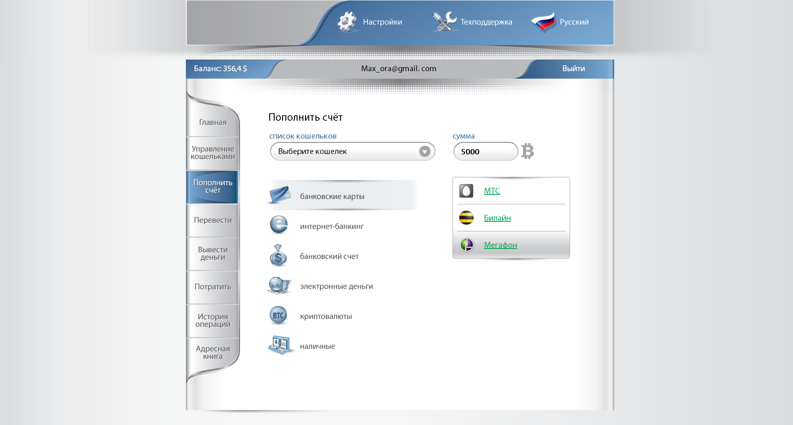
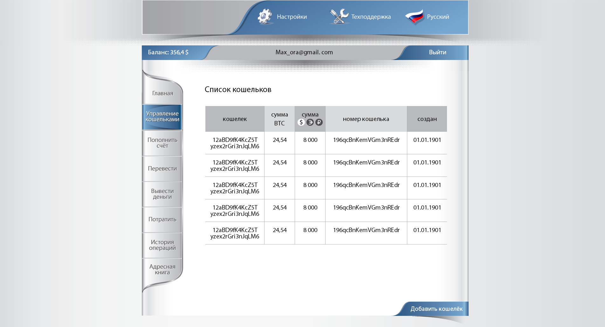
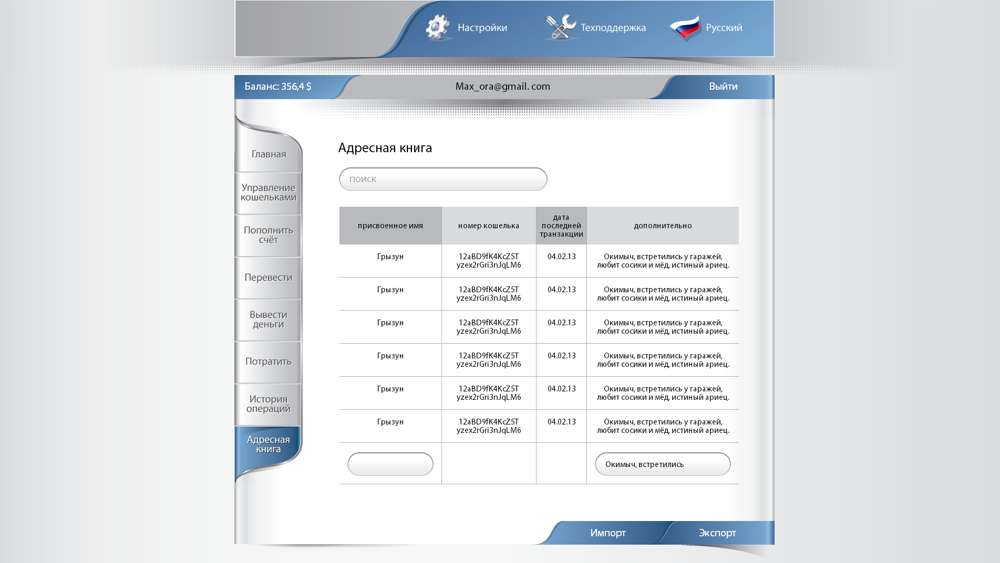
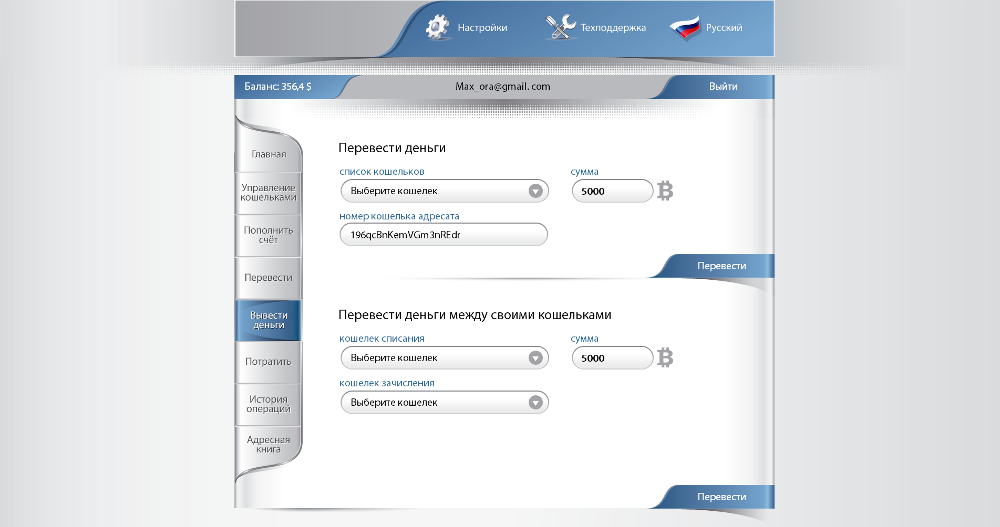
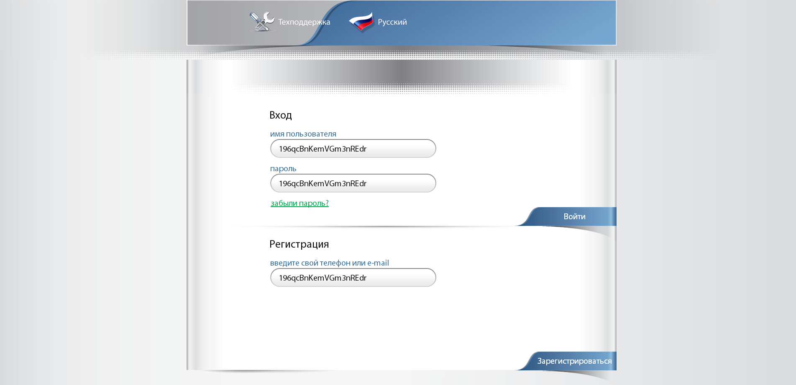

# Макет веб-сайта "Биткоин-кошелёк"

Заказчик прислал макеты в PSD, по этим макетам сделал вёрстку

### [Главная страница](http://enrikolabriko.github.io/bitWallet/site-04.html "Главная страница")

### [Страница регистрации](http://enrikolabriko.github.io/bitWallet/site-03.html "Страница регистрации")

### [Пополнение счёта](http://enrikolabriko.github.io/bitWallet/site-07.html "Пополнение счёта")

### [История операций](http://enrikolabriko.github.io/bitWallet/site-10.html "История операций")

### [Список кошельков](http://enrikolabriko.github.io/bitWallet/site-06.html "Список кошельков")

### [Партнёры](http://enrikolabriko.github.io/bitWallet/site-09.html "Партнёры")

### [Адресная книга](http://enrikolabriko.github.io/bitWallet/site-11.html "Адресная книга")

### [Настройки](http://enrikolabriko.github.io/bitWallet/settings.html "Настройки")

### [Доп. настройки](http://enrikolabriko.github.io/bitWallet/other-settings.html "Доп. настройки")

<!-- ### [Перевод денег](http://enrikolabriko.github.io/bitWallet/site-08.html "Перевод денег")

### [Подтверждение платежа](http://enrikolabriko.github.io/bitWallet/site-05.html "Подтверждение платежа")

### [Страница входа](http://enrikolabriko.github.io/bitWallet/site-01.html "Страница входа")

 -->