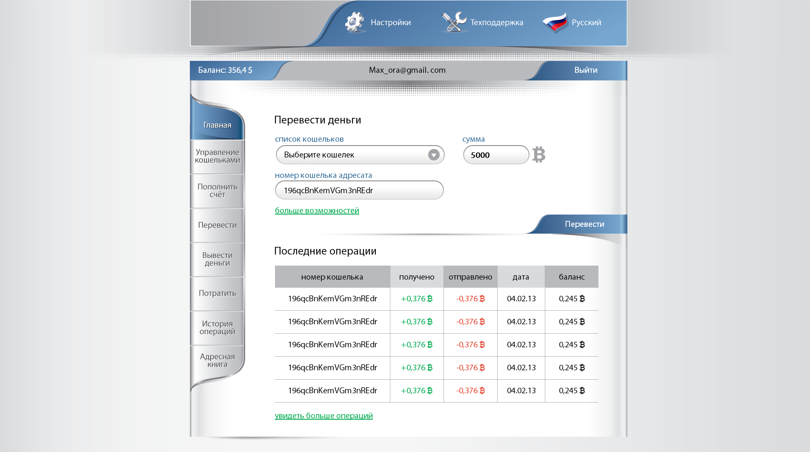

# Макет веб-сайта "Биткоин-кошелёк"

Заказчик прислал макеты в PSD, по этим макетам сделал вёрстку

### [Главная страница](http://enrikolabriko.github.io/bitWallet/site-04.html "Главная страница")

### Страница регистрации

### Пополнение счёта

### История операций

### Доп. настройки

